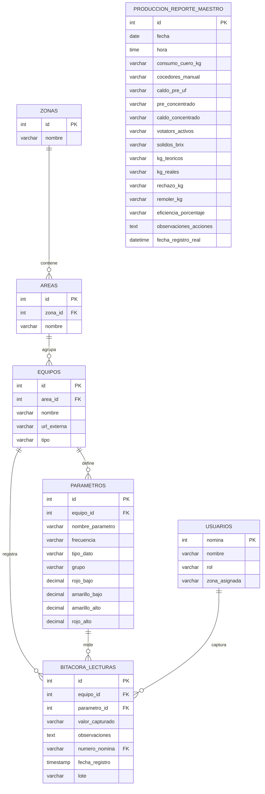

# DICCIONARIO DE DATOS - SISTEMA PROGEL CORE

> **Fecha de actualización:** Septiembre 2026  
> **Servidor:** MySQL 8.x / MariaDB (WampServer)  
> **Juego de caracteres:** `utf8mb4` / `utf8mb4_unicode_ci`  
> **Zona Horaria del Sistema:** `America/Mazatlan` (GMT-7)

---

## 1. Arquitectura General de Datos

El sistema de control de planta PROGEL opera mediante dos bases de datos interconectadas:

1. **`progel_cores`**:
   - Administra el portal web, seguridad de usuarios y permisos.
   - Contiene la jerarquía maestra de planta: **Zonas ➔ Áreas ➔ Equipos ➔ Parámetros**.
   - Almacena el histórico de lecturas manuales de equipos (`bitacora_lecturas`).
   - Almacena las capturas horarias de la sábana de planta (`produccion_reporte_maestro`).

2. **`progel_procesos`**:
   - Administra datos de proceso continuo integrados con PLC y sistemas SCADA (Aveva / Wonderware).
   - Registra parámetros de clarificador, cocedores, concentradores, tanques y verificación física de secado (`verificacion_secado`).

---

## 2. Diagrama de Relaciones (`progel_cores`)

---

## 3. Catálogo Detallado de Tablas (`progel_cores`)

### 3.1. `produccion_reporte_maestro`
*Propósito:* Almacena el consolidado horario de la sábana de producción (Reporte Maestro) tanto para turno Diurno (07:00 a 18:00) como Nocturno (19:00 a 06:00).

| Campo | Tipo | Nulo | Descripción / Unidad |
| :--- | :--- | :--- | :--- |
| `id` | `INT` | NO | Clave primaria autoincremental. |
| `fecha` | `DATE` | NO | Fecha de producción operativa (AAAA-MM-DD). |
| `hora` | `TIME` | NO | Hora nominal del turno (ej. 07:00:00). |
| `fecha_registro_real` | `DATETIME` | SÍ | Marca de tiempo exacta del servidor al momento del guardado. |
| `consumo_cuero_kg` | `VARCHAR(50)` | SÍ | Consumo de materia prima (cuero) por hora en kilogramos. |
| `cocedores_manual` | `VARCHAR(50)` | SÍ | Cantidad de cocedores operados manualmente. |
| `caldo_pre_uf` | `VARCHAR(50)` | SÍ | Litros o nivel de caldo previo a Ultrafiltración (Pre-UF). |
| `pre_concentrado` | `VARCHAR(50)` | SÍ | Nivel o litros en Pre-Concentrador. |
| `caldo_concentrado` | `VARCHAR(50)` | SÍ | Nivel o litros en Caldo Concentrado. |
| `votators_activos` | `VARCHAR(50)` | SÍ | Número de unidades Votator en operación simultánea. |
| `flujo_votator_1` a `6` | `VARCHAR(50)` | SÍ | Flujo individual de alimentación a cada Votator (L/h). Soporta `F.O.` o `LAVADO`. |
| `solidos_brix` | `VARCHAR(50)` | SÍ | Porcentaje de concentración de sólidos solubles (°Bx). |
| `humedad_tunel_1` a `5` | `VARCHAR(50)` | SÍ | Porcentaje de humedad en túneles de secado 1 al 5 (%). |
| `velocidad_tunel_1` a `4` | `VARCHAR(50)` | SÍ | Velocidad de malla/cinta de túneles 1 al 4 (Hz o RPM). |
| `kg_teoricos` | `VARCHAR(50)` | SÍ | Kilogramos teóricos proyectados según flujo y Brix. |
| `kg_reales` | `VARCHAR(50)` | SÍ | Kilogramos reales empacados y registrados en la hora. |
| `rechazo_kg` | `VARCHAR(50)` | SÍ | Material no conforme separado en kilogramos. |
| `remoler_kg` | `VARCHAR(50)` | SÍ | Material apto para reproceso en kilogramos. |
| `eficiencia_porcentaje`| `VARCHAR(50)` | SÍ | Rendimiento operativo porcentual (`(kg_reales / kg_teoricos) * 100`). |
| `observaciones_acciones`| `TEXT` | SÍ | Notas operativas, paros, justificaciones y acciones tomadas. |

> **Nota de compatibilidad:** Existe la vista virtual `sup_captura_produccion` que mapea estos campos a sus nombres antiguos para garantizar compatibilidad retroactiva total.

---

### 3.2. `bitacora_lecturas`
*Propósito:* Registro transaccional de todas las lecturas capturadas por los operadores en las estaciones de monitoreo de equipo.

| Campo | Tipo | Nulo | Descripción |
| :--- | :--- | :--- | :--- |
| `id` | `INT` | NO | Clave primaria autoincremental. |
| `equipo_id` | `INT` | NO | Llave foránea hacia `equipos.id`. |
| `parametro_id` | `INT` | NO | Llave foránea hacia `parametros.id`. |
| `valor_capturado` | `VARCHAR(255)`| NO | Valor numérico o cualitativo (`Realizado`, `Sí`, `No`, etc.). |
| `observaciones` | `TEXT` | SÍ | Comentarios o motivos de desviación fuera de semáforo. |
| `numero_nomina` | `VARCHAR(50)` | NO | Número de nómina del operador que registró la lectura. |
| `fecha_registro` | `TIMESTAMP` | NO | Fecha y hora exacta del registro en el sistema. |
| `lote` | `VARCHAR(100)`| SÍ | Código de lote de producción en curso (si aplica). |

---

### 3.3. `parametros`
*Propósito:* Catálogo maestro de variables inspeccionadas, límites de control de semáforo y periodicidad.

| Campo | Tipo | Nulo | Descripción |
| :--- | :--- | :--- | :--- |
| `id` | `INT` | NO | Clave primaria autoincremental. |
| `equipo_id` | `INT` | NO | Equipo al que pertenece la variable (`equipos.id`). |
| `nombre_parametro` | `VARCHAR(150)`| NO | Nombre legible (ej. *Presión de alta Chiller 1*). |
| `frecuencia` | `VARCHAR(20)` | SÍ | Frecuencia de captura (`HORARIA`, `TURNO`, `DIARIA`, `SEMANAL`). |
| `tipo_dato` | `VARCHAR(20)` | SÍ | Tipo de entrada esperada (`NUMERICO`, `TEXTO`, `CHECK`). |
| `grupo` | `VARCHAR(50)` | SÍ | Agrupador para visualización en tarjetas. |
| `rojo_bajo` | `DECIMAL(10,2)`| SÍ | Umbral inferior crítico (Alarma roja). |
| `amarillo_bajo` | `DECIMAL(10,2)`| SÍ | Umbral inferior de advertencia (Alarma amarilla). |
| `amarillo_alto` | `DECIMAL(10,2)`| SÍ | Umbral superior de advertencia (Alarma amarilla). |
| `rojo_alto` | `DECIMAL(10,2)`| SÍ | Umbral superior crítico (Alarma roja). |

---

### 3.4. `equipos`
*Propósito:* Maquinaria y estaciones de trabajo organizadas por área.

| Campo | Tipo | Descripción |
| :--- | :--- | :--- |
| `id` | `INT` | Clave primaria. |
| `area_id` | `INT` | Área operativa a la que pertenece (`areas.id`). |
| `nombre` | `VARCHAR(100)` | Nombre oficial del equipo (ej. *Chillers Normales*, *Compresores*). |
| `url_externa` | `VARCHAR(255)` | Enlace a SCADA, Aveva o cámara web si aplica. |
| `tipo` | `VARCHAR(50)` | Clasificación técnica para renderizado de bloques especializados. |

---

### 3.5. `areas` y `zonas`
*Propósito:* División física de la planta.
- **`zonas`**: Nivel macro (ej. *Zona 1: Proceso*, *Zona 2: Servicios*, *Zona 3: Secado*).
- **`areas`**: Subdivisión operativa dentro de cada zona (ej. *Área de Concentradores*, *Área de Chillers*, *Área Votator*).

---

### 3.6. `usuarios`
*Propósito:* Control de acceso y autoría de registros en planta.

| Campo | Tipo | Descripción |
| :--- | :--- | :--- |
| `nomina` | `INT` | Clave primaria. Número de nómina único del empleado. |
| `nombre` | `VARCHAR(100)` | Nombre completo del operador, supervisor o administrador. |
| `rol` | `VARCHAR(20)` | Nivel de permisos (`OPERADOR`, `SUPERVISOR`, `ADMIN`, `JEFATURA`). |
| `zona_asignada`| `VARCHAR(50)` | Restricción opcional de estación de trabajo. |

---

## 4. Vistas SQL Legibles (`VIEWS`)

1. **`v_bitacora_completa`**:
   Une `bitacora_lecturas` con `equipos`, `parametros` y `usuarios` para exportaciones directas a Excel o consultas gerenciales sin necesidad de escribir múltiples `JOIN`.
2. **`sup_captura_produccion`**:
   Vista de compatibilidad con alias directos a la tabla física `produccion_reporte_maestro`.
